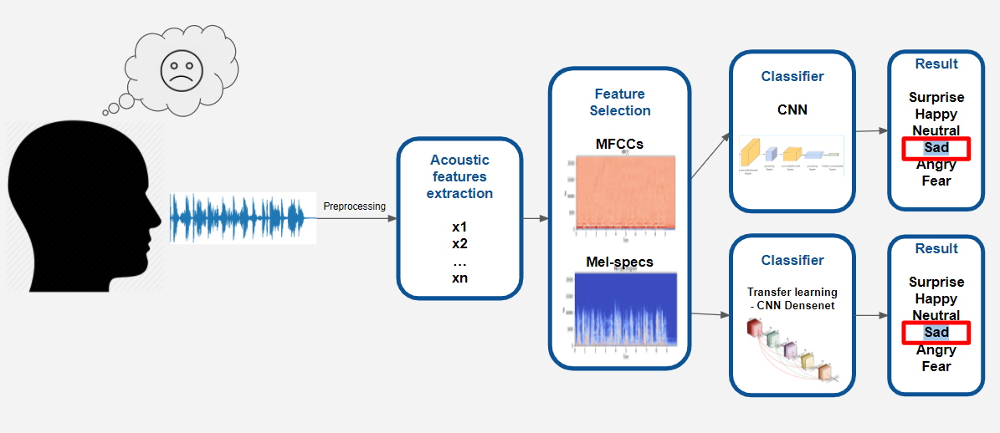

# Speech Emotion Recognition  

## Description
This project is a part of the final **Data Mining** project for **ITC Fellow Program 2020**. 

Datasets used in this project
* Crowd-sourced Emotional Mutimodal Actors Dataset (**Crema-D**)
* Ryerson Audio-Visual Database of Emotional Speech and Song (**Ravdess**)
* Surrey Audio-Visual Expressed Emotion (**Savee**)
* Toronto emotional speech set (**Tess**)

Digital signal processing is an emerging field of research in this era. Recently, many researchers have developed a various approaches in this area for SER from over the past decade.

Typically, the SER task is divided into two main sections: features selection and classification. The discriminative features selection and classification method that correctly recognizes the emotional state of the speaker in this domain is a challenging task

*Our project pipeline*

Nowadays, mostly researchers utilize deep learning techniques for SER using Mel-scale filter bank speech spectrogram as an input feature. A spectrogram is a 2-D representation of speech signals which is widely used in convolutional neural networks (CNNs) for extracting the salient and discriminative features. Similarly, we can utilize the transfer learning strategies for SER using speech spectrograms passing through pre-trained CNNs models like VGG, DenseNet or Alex-Net. 

Mel-Frequency Cepstral Coefficients, which are a representation of the short-term power spectrum of a sound by transforming the audio signal, are also considered to be an important feature for SER.

The Mel scale is important because it better approximates human-based perception of sound as opposed to linear scales. In filter-source theory, "the source is the vocal cords and the filter represents the vocal tract." The length and shape of the vocal tract determine how sound is outputted from a human and the cepstrum can describe the filter. 

